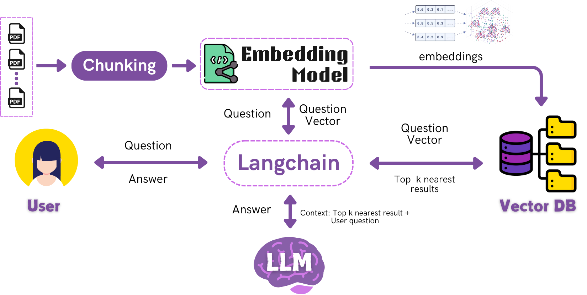

# Hybrid Documents RAG based Chatbot

## Abstract

State-of-the-art commercial conversational models
are typically limited to public data, lacking direct access to
personal or specialized documents due to security concerns about
exposing sensitive information. To bridge this gap, the Hybrid
Documents RAG based Chatbot empowers users to securely tap
into their own document collections for personalized information
retrieval. By seamlessly combining rapid local indexing, context-
sensitive ranking, and reranking, the system enables fast, precise
searches without relying on cloud-based services. This privacy-
centric design ensures that sensitive data remains safely on-
device, while also offering online mode for accessing more compu-
tational power. Ultimately, the chatbot offers a groundbreaking
paradigm in personalized information discovery, striking an ideal
balance between performance, flexibility, and security.

## Features

- **Hybrid Retrieval** – Supports both online (web search) and offline (local document search) for flexibility and privacy.  
- **Efficient Document Processing** – Extracts text from PDFs, DOCX, and other formats using semantic and fixed-size chunking for better context.  
- **Vector-Based Search** – Uses FAISS and embeddings for fast and accurate information retrieval.  
- **Reranking for Accuracy** – Combines BM25, cross-encoders, and hybrid retrieval to improve search relevance.  
- **Adaptive AI Models** – SLMs for speed, LLMs for complex queries, with dynamic selection based on query needs.  
- **Interactive Conversational Search** – Refines responses with follow-up queries and learns from user feedback.  
- **Privacy & Security** – Offline mode ensures sensitives data stays on-device, reducing cloud dependencies.  
- **User-Friendly Interface** – Enables seamless document search with conversational interaction.  

This chatbot enhances document-based search with AI-driven conversation, accuracy, and privacy.  

---
## Rag Pipeline


---
## How to run the Project?

### Prerequisites
1. **Install Ollama**:
   - Download and install Ollama from [ollama.com](https://ollama.com/).
   - Install required models (e.g., `qwen2.5:0.5b`, `nomic-embed-text`):
     ```bash
     ollama pull qwen2.5:0.5b
     ollama pull nomic-embed-text
     ```

2. **MongoDB Setup**:
   - Install MongoDB Compass and create a database named `rag_app_db` with a collection `sessions`.

### Running it
- From the main directory run following command
```
python main.py
```

This will start Frontend, Backend, MongoDb and Ollama.

## Demo
<video width="400" controls>
  <source src="Reports/Demo/RAG%20Project%20Demo.mp4" type="video/mp4">
  Your browser does not support the video tag.
</video>


## Contributors

- **Maharun Afroz** 
- **Sanjida Amin Nadia**
- **Tasnia Hossain**
- **Tahmina Mozumdar**
---

